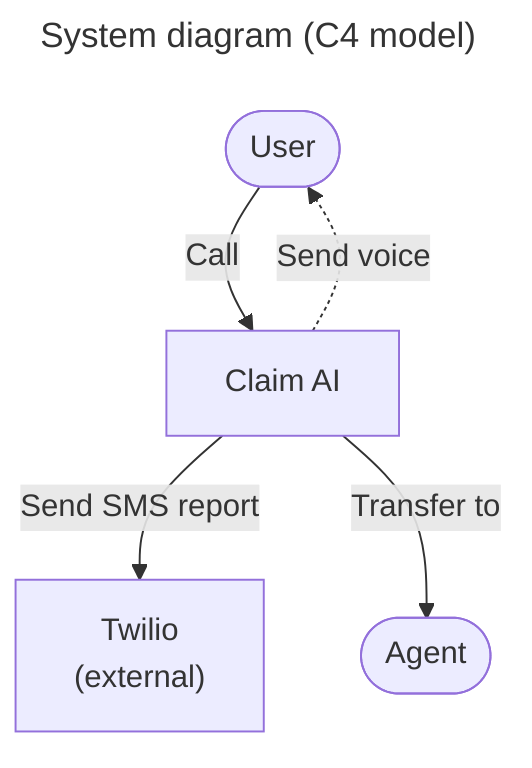
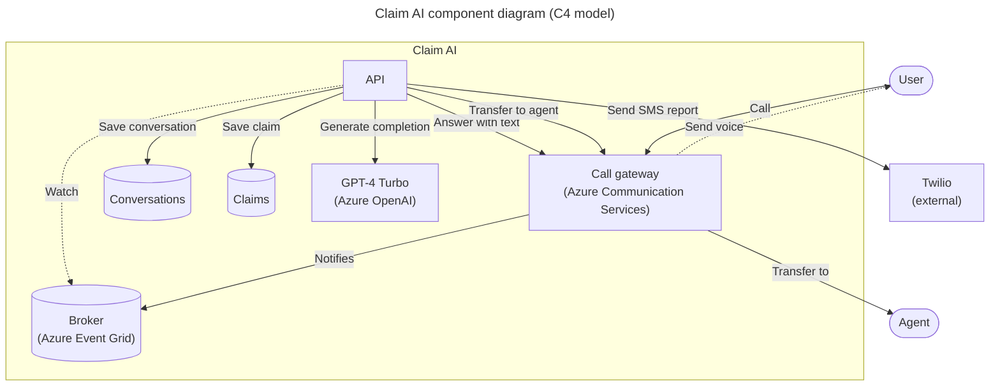

# Groupama Diva PoC

## Overview

### Features

- [x] Access to customer conversation history
- [x] Bot can be called from a phone number
- [x] Disengaging from a human agent when needed
- [x] Fine understanding of the customer request with GPT-4 Turbo
- [x] Follow a specific data schema for the claim
- [x] Help the user to find the information needed to complete the claim
- [x] Send a SMS report after the call
- [ ] Access the claim on a public website
- [ ] Call back the user when needed
- [ ] Simulate a IVR workflow

### High level architecture



### Component level architecture



## Installation

### Prerequisites

Place a file called `config.yaml` in the root of the project with the following content:

```yaml
# config.yaml
api:
  root_path: "/"

monitoring:
  logging:
    app_level: INFO
    sys_level: WARN

resources:
  public_url: "https://xxx.blob.core.windows.net/public"

workflow:
  agent_phone_number: "+33612345678"
  bot_company: Contoso
  bot_name: Robert
  conversation_lang: fr-FR

communication_service:
  access_key: xxx
  endpoint: https://xxx.france.communication.azure.com
  phone_number: "+33612345678"

cognitive_service:
  # Must be of type "Azure AI services multi-service account"
  # See: https://learn.microsoft.com/en-us/azure/ai-services/multi-service-resource?tabs=macos&pivots=azportal#create-a-new-multi-service-resource
  endpoint: https://xxx.cognitiveservices.azure.com

openai:
  endpoint: https://xxx.openai.azure.com
  gpt_deployment: gpt-4-turbo
  gpt_model: gpt-4-1106-preview

eventgrid:
  resource_group: claim-ai-poc
  subscription_id: xxx
  system_topic: claim-ai-poc
```

Then run:

```bash
# Install dependencies
make install
```

Also, a public file server is needed to host the audio files.

For this, you can use Azure Blob Storage. In that case, content of the project folder `resources` requires to be uploaded to the public container of the storage account.

### Run

Finally, in two different terminals, run:

```bash
# Expose the local server to the internet
make tunnel
```

```bash
# Start the local API server
make start
```
