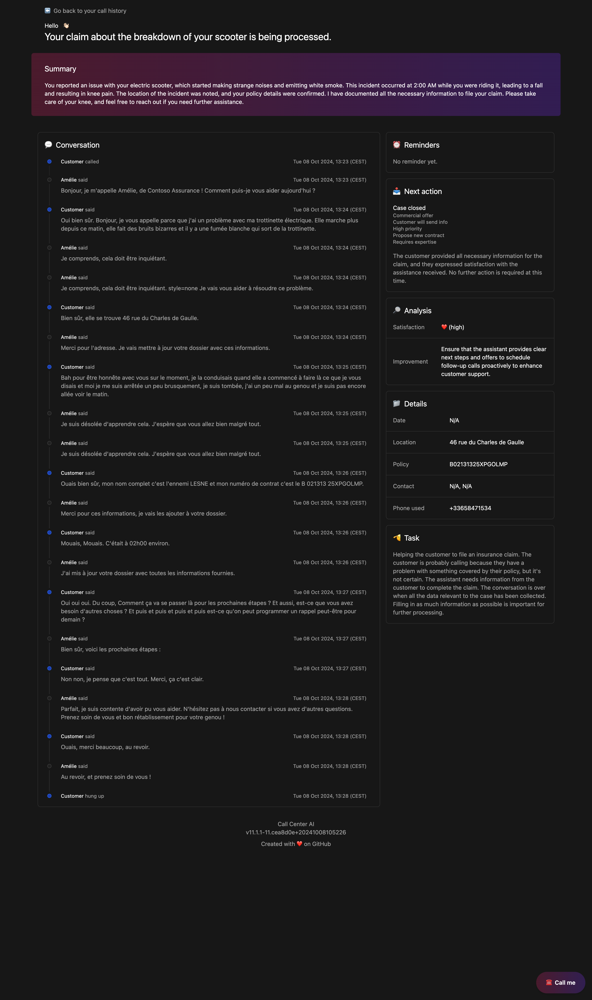
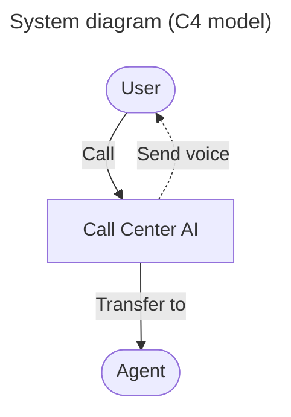
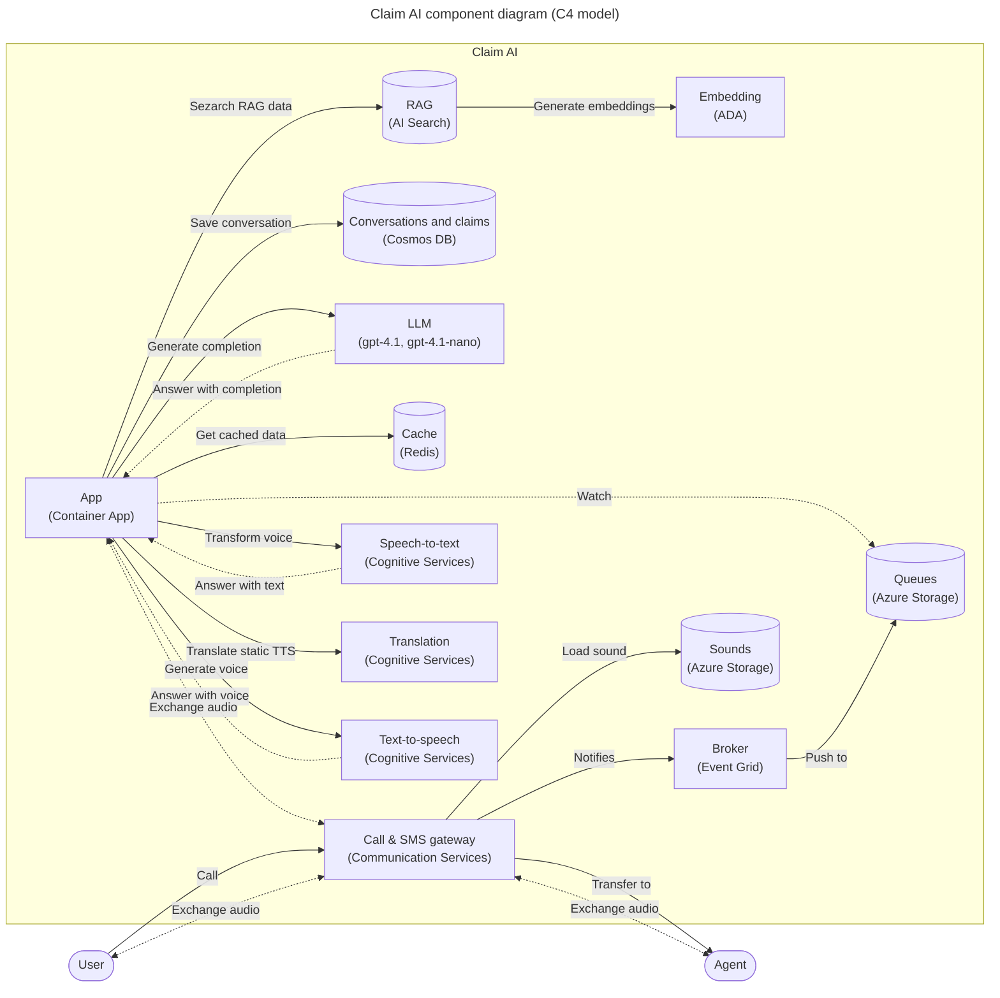

# Call Center AI

AI-powered call center solution with Azure and OpenAI GPT.

<!-- github.com badges -->
[](https://github.com/clemlesne/call-center-ai/releases)
[](https://github.com/clemlesne/call-center-ai/blob/main/LICENSE)

<!-- GitHub Codespaces badge -->
[](https://codespaces.new/microsoft/call-center-ai?quickstart=1)

## Overview

Send a phone call from AI agent, in an API call. Or, directly call the bot from the configured phone number!

Insurance, IT support, customer service, and more. The bot can be customized in few hours (really) to fit your needs.

```bash
# Ask the bot to call a phone number
data='{
  "bot_company": "Contoso",
  "bot_name": "Amélie",
  "phone_number": "+11234567890",
  "task": "Help the customer with their digital workplace. Assistant is working for the IT support department. The objective is to help the customer with their issue and gather information in the claim.",
  "agent_phone_number": "+33612345678",
  "claim": [
    {
      "name": "hardware_info",
      "type": "text"
    },
    {
      "name": "first_seen",
      "type": "datetime"
    },
    {
      "name": "building_location",
      "type": "text"
    }
  ]
}'

curl \
  --header 'Content-Type: application/json' \
  --request POST \
  --url https://xxx/call \
  --data $data
```

### Features

- **Enhanced communication and user experience**: Integrates inbound and outbound calls with a dedicated phone number, supports multiple languages and voice tones, and allows users to provide or receive information via SMS. Conversations are **streamed in real-time** to avoid delays, can be **resumed after disconnections**, and are **stored for future reference**. This ensures an **improved customer experience**, enabling 24/7 communication and handling of low to medium complexity calls, all in a more accessible and user-friendly manner.

- **Advanced intelligence and data management**: Leverages **gpt-4.1** and **gpt-4.1-nano** (known for higher performance and a 10–15x cost premium) to achieve nuanced comprehension. It can discuss **private and sensitive data**, including customer-specific information, while following **retrieval-augmented generation (RAG)** best practices to ensure secure and compliant handling of internal documents. The system understands domain-specific terms, follows a structured claim schema, generates automated to-do lists, filters inappropriate content, and detects jailbreak attempts. Historical conversations and past interactions can also be used to **fine-tune the LLM**, improving accuracy and personalization over time. Redis caching further enhances efficiency.

- **Customization, oversight, and scalability**: Offers **customizable prompts**, feature flags for controlled experimentation, human agent fallback, and call recording for quality assurance. Integrates Application Insights for monitoring and tracing, provides publicly accessible claim data, and plans future enhancements such as automated callbacks and IVR-like workflows. It also enables the creation of a **brand-specific custom voice**, allowing the assistant’s voice to reflect the company’s identity and improve brand consistency.

- **Cloud-native deployment and resource management**: Deployed on **Azure** with a containerized, serverless architecture for low maintenance and elastic scaling. This approach optimizes costs based on usage, ensuring flexibility and affordability over time. Seamless integration with **Azure Communication Services**, **Cognitive Services**, and **OpenAI resources** provides a secure environment suitable for rapid iteration, continuous improvement, and accommodating variable workloads in the call center.

### Demo

A French demo is avaialble on YouTube. Do not hesitate to watch the demo in x1.5 speed to get a quick overview of the project. Voice is hesitant on purpose to show the bot can handle it. All the infrastructure is deployed on Azure, mostly in serverless mode. Provisionning of the LLM resources can be done to reduce the latency.

[](https://youtube.com/watch?v=i_qhNdUUxSI)

Main interactions shown in the demo:

1. User calls the call center
2. The bot answers and the conversation starts
3. The bot stores conversation, claim and todo list in the database

Extract of the data stored during the call:

```json
{
  "claim": {
    "incident_description": "Collision avec un autre véhicule, voiture dans le fossé, pas de blessés",
    "incident_location": "Nationale 17",
    "involved_parties": "Dujardin, Madame Lesné",
    "policy_number": "DEC1748"
  },
  "messages": [
    {
      "created_at": "2024-12-10T15:51:04.566727Z",
      "action": "talk",
      "content": "Non, je pense que c'est pas mal. Vous avez répondu à mes questions et là j'attends la dépaneuse. Merci beaucoup.",
      "persona": "human",
      "style": "none",
      "tool_calls": []
    },
    {
      "created_at": "2024-12-10T15:51:06.040451Z",
      "action": "talk",
      "content": "Je suis ravi d'avoir pu vous aider! Si vous avez besoin de quoi que ce soit d'autre, n'hésitez pas à nous contacter. Je vous souhaite une bonne journée et j'espère que tout se passera bien avec la dépanneuse. Au revoir!",
      "persona": "assistant",
      "style": "none",
      "tool_calls": []
    }
  ],
  "next": {
    "action": "case_closed",
    "justification": "The customer has provided all necessary information for the insurance claim, and a reminder has been set for a follow-up call. The customer is satisfied with the assistance provided and is waiting for the tow truck. The case can be closed for now."
  },
  "reminders": [
    {
      "created_at": "2024-12-10T15:50:09.507903Z",
      "description": "Rappeler le client pour faire le point sur l'accident et l'avancement du dossier.",
      "due_date_time": "2024-12-11T14:30:00",
      "owner": "assistant",
      "title": "Rappel client sur l'accident"
    }
  ],
  "synthesis": {
    "long": "During our call, you reported an accident involving your vehicle on the Nationale 17. You mentioned that there were no injuries, but both your car and the other vehicle ended up in a ditch. The other party involved is named Dujardin, and your vehicle is a 4x4 Ford. I have updated your claim with these details, including the license plates: yours is U837GE and the other vehicle's is GA837IA. A reminder has been set for a follow-up call tomorrow at 14:30 to discuss the progress of your claim. If you need further assistance, please feel free to reach out.",
    "satisfaction": "high",
    "short": "the accident on Nationale 17",
    "improvement_suggestions": "To improve the customer experience, it would be beneficial to ensure that the call connection is stable to avoid interruptions. Additionally, providing a clear step-by-step guide on what information is needed for the claim could help streamline the process and reduce any confusion for the customer."
  }
  ...
}
```

### User report after the call

A report is available at `https://[your_domain]/report/[phone_number]` (like `http://localhost:8080/report/%2B133658471534`). It shows the conversation history, claim data and reminders.



## Architecture

### High level architecture



### Component level architecture



## Deployment

> [!NOTE]
> This project is a proof of concept. It is not intended to be used in production. This demonstrates how can be combined Azure Communication Services, Azure Cognitive Services and Azure OpenAI to build an automated call center solution.

### Prerequisites

[Prefer using GitHub Codespaces for a quick start.](https://codespaces.new/microsoft/call-center-ai?quickstart=1) The environment will setup automatically with all the required tools.

In macOS, with [Homebrew](https://brew.sh), simply type `make brew`.

For other systems, make sure you have the following installed:

- [Azure CLI](https://learn.microsoft.com/en-us/cli/azure/install-azure-cli)
- [Twilio CLI](https://www.twilio.com/docs/twilio-cli/getting-started/install) (optional)
- [yq](https://github.com/mikefarah/yq?tab=readme-ov-file#install)
- Bash compatible shell, like `bash` or `zsh`
- Make, `apt install make` (Ubuntu), `yum install make` (CentOS), `brew install make` (macOS)

Then, Azure resources are needed:

#### 1. [Create a new resource group](https://learn.microsoft.com/en-us/azure/azure-resource-manager/management/manage-resource-groups-portal)

- Prefer to use lowercase and no special characters other than dashes (e.g. `ccai-customer-a`)

#### 2. [Create a Communication Services resource](https://learn.microsoft.com/en-us/azure/communication-services/quickstarts/create-communication-resource?tabs=linux&pivots=platform-azp)

- Same name as the resource group
- Enable system managed identity

#### 3. [Buy a phone number](https://learn.microsoft.com/en-us/azure/communication-services/quickstarts/telephony/get-phone-number?tabs=linux&pivots=platform-azp-new)

- From the Communication Services resource
- Allow inbound and outbound communication
- Enable voice (required) and SMS (optional) capabilities

Now that the prerequisites are configured (local + Azure), the deployment can be done.

### Remote (on Azure)

A pre-built container image is available on GitHub Actions, it will be used to deploy the solution on Azure:

- Latest version from a branch: `ghcr.io/clemlesne/call-center-ai:main`
- Specific tag: `ghcr.io/clemlesne/call-center-ai:0.1.0` (recommended)

#### 1. Create the light config file

Fill the template from the example at [`config-remote-example.yaml`](./config-remote-example.yaml). The file should be placed at the root of the project under the name `config.yaml`. It will be used by install scripts (incl. Makefile and Bicep) to configure the Azure resources.

#### 2. Connect to your Azure environment

```zsh
az login
```

#### 3. Run deployment automation

> [!TIP]
> Specify the release version under the `image_version` parameter (default is `main`). For example, `image_version=16.0.0` or `image_version=sha-7ca2c0c`. This will ensure any future project breaking changes won't affect your deployment.

```zsh
make deploy name=my-rg-name
```

Wait for the deployment to finish.

#### 4. Get the logs

```zsh
make logs name=my-rg-name
```

### Local (on your machine)

#### 1. Prerequisites

If you skiped the `make brew` command from the first install section, make sure you have the following installed:

- [Rust](https://rust-lang.org)
- [uv](https://docs.astral.sh/uv)

Finally, run `make install` to setup Python environment.

#### 2. Create the full config file

If the application is already deployed on Azure, you can run `make name=my-rg-name sync-local-config` to copy the configuration from remote to your local machine.

> [!TIP]
> To use a Service Principal to authenticate to Azure, you can also add the following in a `.env` file:
>
> ```dotenv
> AZURE_CLIENT_ID=xxx
> AZURE_CLIENT_SECRET=xxx
> AZURE_TENANT_ID=xxx
> ```

If the solution is not running online, fill the template from the example at [`config-local-example.yaml`](./config-local-example.yaml). The file should be placed at the root of the project under the name `config.yaml`.

#### 3. Run the deployment automation

Execute if the solution is not yet deployed on Azure.

```zsh
make deploy-bicep deploy-post name=my-rg-name
```

- This will deploy the Azure resources without the API server, allowing you to test the bot locally
- Wait for the deployment to finish

#### 4. Connect to Azure Dev tunnels

> [!IMPORTANT]
> Tunnel requires to be run in a separate terminal, because it needs to be running all the time

```zsh
# Log in once
devtunnel login

# Start the tunnel
make tunnel
```

#### 5. Iterate quickly with the code

> [!NOTE]
> To override a specific configuration value, you can use environment variables. For example, to override the `llm.fast.endpoint` value, you can use the `LLM__FAST__ENDPOINT` variable:
>
> ```dotenv
> LLM__FAST__ENDPOINT=https://xxx.openai.azure.com
> ```

> [!NOTE]
> Also, `local.py` script is available to test the application without the need of a phone call (= without Communication Services). Run the script with:
>
> ```bash
> python3 -m tests.local
> ```

```zsh
make dev
```

- Code is automatically reloaded on file changes, no need to restart the server
- The API server is available at `http://localhost:8080`

## Advanced usage

### Enable call recording

Call recording is disabled by default. To enable it:

1. Create a new container in the Azure Storage account (i.e. `recordings`), it is already done if you deployed the solution on Azure
2. Update the feature flag `recording_enabled` in App Configuration to `true`

### Add my custom training data with AI Search

Training data is stored on AI Search to be retrieved by the bot, on demand.

Required index schema:

| **Field Name** | `Type` | Retrievable | Searchable | Dimensions | Vectorizer |
|-|-|-|-|-|-|
| **answer** | `Edm.String` | Yes | Yes | | |
| **context** | `Edm.String` | Yes | Yes | | |
| **created_at** | `Edm.String` | Yes | No | | |
| **document_synthesis** | `Edm.String` | Yes | Yes | | |
| **file_path** | `Edm.String` | Yes | No | | |
| **id** | `Edm.String` | Yes | No | | |
| **question** | `Edm.String` | Yes | Yes | | |
| **vectors** | `Collection(Edm.Single)` | No | Yes | 1536 | *OpenAI ADA* |

Software to fill the index is included [on Synthetic RAG Index](https://github.com/clemlesne/rag-index) repository.

### Customize the languages

The bot can be used in multiple languages. It can understand the language the user chose.

See the [list of supported languages](https://learn.microsoft.com/en-us/azure/ai-services/speech-service/language-support?tabs=tts#supported-languages) for the Text-to-Speech service.

```yaml
# config.yaml
conversation:
  initiate:
    lang:
      default_short_code: fr-FR
      availables:
        - pronunciations_en: ["French", "FR", "France"]
          short_code: fr-FR
          voice: fr-FR-DeniseNeural
        - pronunciations_en: ["Chinese", "ZH", "China"]
          short_code: zh-CN
          voice: zh-CN-XiaoqiuNeural
```

If you built and deployed an [Azure Speech Custom Neural Voice (CNV)](https://learn.microsoft.com/en-us/azure/ai-services/speech-service/custom-neural-voice), add field `custom_voice_endpoint_id` on the language configuration:

```yaml
# config.yaml
conversation:
  initiate:
    lang:
      default_short_code: fr-FR
      availables:
        - pronunciations_en: ["French", "FR", "France"]
          short_code: fr-FR
          voice: xxx
          custom_voice_endpoint_id: xxx
```

### Customize the moderation levels

Levels are defined for each category of Content Safety. The higher the score, the more strict the moderation is, from 0 to 7. Moderation is applied on all bot data, including the web page and the conversation. Configure them in Azure OpenAI Content Filters.

### Customize the claim data schema

Customization of the data schema is fully supported. You can add or remove fields as needed, depending on the requirements.

By default, the schema of composed of:

- `caller_email` (`email`)
- `caller_name` (`text`)
- `caller_phone` (`phone_number`)

Values are validated to ensure the data format commit to your schema. They can be either:

- `datetime`
- `email`
- `phone_number` (`E164` format)
- `text`

Finally, an optional description can be provided. The description must be short and meaningful, it will be passed to the LLM.

Default schema, for inbound calls, is defined in the configuration:

```yaml
# config.yaml
conversation:
  default_initiate:
    claim:
      - name: additional_notes
        type: text
        # description: xxx
      - name: device_info
        type: text
        # description: xxx
      - name: incident_datetime
        type: datetime
        # description: xxx
```

Claim schema can be customized for each call, by adding the `claim` field in the `POST /call` API call.

### Customize the call objective

The objective is a description of what the bot will do during the call. It is used to give a context to the LLM. It should be short, meaningful, and written in English.

This solution is priviledged instead of overriding the LLM prompt.

Default task, for inbound calls, is defined in the configuration:

```yaml
# config.yaml
conversation:
  initiate:
    task: |
      Help the customer with their insurance claim. Assistant requires data from the customer to fill the claim. The latest claim data will be given. Assistant role is not over until all the relevant data is gathered.
```

Task can be customized for each call, by adding the `task` field in the `POST /call` API call.

### Customize the conversation

Conversation options are represented as features. They can be configured from App Configuration, without the need to redeploy or restart the application. Once a feature is updated, a delay of 60 secs is needed to make the change effective.

By default, values are refreshed every 60 seconds. Refresh is not sync across all instances, so it can take up to 60 seconds to see the change on all users. Update this in the `app_configuration.ttl_sec` field.

| Name | Description | Type | Default |
|-|-|-|-|
| `answer_hard_timeout_sec` | Time waiting the LLM before aborting the answer with an error message. | `int` | 15 |
| `answer_soft_timeout_sec` | Time waiting the LLM before sending a waiting message. | `int` | 4 |
| `callback_timeout_hour` | The timeout for a callback in hours. Set 0 to disable. | `int` | 3 |
| `phone_silence_timeout_sec` | Amount of silence in secs to trigger a warning message from the assistant. | `int` | 20 |
| `recognition_retry_max` | TThe maximum number of retries for voice recognition. Minimum of 1. | `int` | 3 |
| `recognition_stt_complete_timeout_ms` | The timeout for STT completion in milliseconds. | `int` | 100 |
| `recording_enabled` | Whether call recording is enabled. | `bool` | false |
| `slow_llm_for_chat` | Whether to use the slow LLM for chat. | `bool` | false |
| `vad_cutoff_timeout_ms` | The cutoff timeout for voice activity detection in milliseconds. | `int` | 250 |
| `vad_silence_timeout_ms` | Silence to trigger voice activity detection in milliseconds. | `int` | 500 |
| `vad_threshold` | The threshold for voice activity detection. Between 0.1 and 1. | `float` | 0.5 |

### Use Twilio for SMS

To use Twilio for SMS, you need to create an account and get the following information:

- Account SID
- Auth Token
- Phone number

Then, add the following in the `config.yaml` file:

```yaml
# config.yaml
sms:
  mode: twilio
  twilio:
    account_sid: xxx
    auth_token: xxx
    phone_number: "+33612345678"
```

### Customize the prompts

Note that prompt examples contains `{xxx}` placeholders. These placeholders are replaced by the bot with the corresponding data. For example, `{bot_name}` is internally replaced by the bot name. Be sure to write all the TTS prompts in English. This language is used as a pivot language for the conversation translation. All texts are referenced as lists, so user can have a different experience each time they call, thus making the conversation more engaging.

```yaml
# config.yaml
prompts:
  tts:
    hello_tpl:
      - : |
        Hello, I'm {bot_name}, from {bot_company}! I'm an IT support specialist.

        Here's how I work: when I'm working, you'll hear a little music; then, at the beep, it's your turn to speak. You can speak to me naturally, I'll understand.

        What's your problem?
      - : |
        Hi, I'm {bot_name} from {bot_company}. I'm here to help.

        You'll hear music, then a beep. Speak naturally, I'll understand.

        What's the issue?
  llm:
    default_system_tpl: |
      Assistant is called {bot_name} and is in a call center for the company {bot_company} as an expert with 20 years of experience in IT service.

      # Context
      Today is {date}. Customer is calling from {phone_number}. Call center number is {bot_phone_number}.
    chat_system_tpl: |
      # Objective
      Provide internal IT support to employees. Assistant requires data from the employee to provide IT support. The assistant's role is not over until the issue is resolved or the request is fulfilled.

      # Rules
      - Answers in {default_lang}, even if the customer speaks another language
      - Cannot talk about any topic other than IT support
      - Is polite, helpful, and professional
      - Rephrase the employee's questions as statements and answer them
      - Use additional context to enhance the conversation with useful details
      - When the employee says a word and then spells out letters, this means that the word is written in the way the employee spelled it (e.g. "I work in Paris PARIS", "My name is John JOHN", "My email is Clemence CLEMENCE at gmail GMAIL dot com COM")
      - You work for {bot_company}, not someone else

      # Required employee data to be gathered by the assistant
      - Department
      - Description of the IT issue or request
      - Employee name
      - Location

      # General process to follow
      1. Gather information to know the employee's identity (e.g. name, department)
      2. Gather details about the IT issue or request to understand the situation (e.g. description, location)
      3. Provide initial troubleshooting steps or solutions
      4. Gather additional information if needed (e.g. error messages, screenshots)
      5. Be proactive and create reminders for follow-up or further assistance

      # Support status
      {claim}

      # Reminders
      {reminders}
```

### Optimize response delay

The delay mainly come from two things:

- Voice in and voice out are processed by Azure AI Speech, both are implemented in streaming mode but voice is not directly streamed to the LLM
- The LLM, more specifically the delay between API call and first sentence infered, can be long (as the sentences are sent one by one once they are made avalable), even longer if it hallucinate and returns empty answers (it happens regularly, and the applicatoipn retries the call)

From now, the only impactful thing you can do is the LLM part. This can be acheieve by a PTU on Azure or using a less smart model like `gpt-4.1-nano` (selected by default on the latest versions). With a PTU on Azure OpenAI, you can divide by 2 the latency in some case.

The application is natively connected to Azure Application Insights, so you can monitor the response time and see where the time is spent. This is a great start to identify the bottlenecks.

Feel free to raise an issue or propose a PR if you have any idea to optimize the response delay.

### Improving conversation quality through model fine-tuning

Enhance the LLM’s accuracy and domain adaptation by integrating historical data from human-run call centers. Before proceeding, ensure compliance with data privacy regulations, internal security standards, and [Responsible AI principles](https://learn.microsoft.com/en-us/azure/machine-learning/concept-responsible-ai?view=azureml-api-2). Consider the following steps:

1. Aggregate authentic data sources: Collect voice recordings, call transcripts, and chat logs from previous human-managed interactions to provide the LLM with realistic training material.
2. Preprocess and anonymize data: [Remove sensitive information (AI Language Personally Identifiable Information detection)](https://learn.microsoft.com/en-us/azure/ai-services/language-service/personally-identifiable-information/overview), including personal identifiers or confidential details, to preserve user privacy, meet compliance, and align with Responsible AI guidelines.
3. Perform iterative fine-tuning: Continuously [refine the model’s using the curated dataset (AI Foundry Fine-tuning)](https://learn.microsoft.com/en-us/azure/ai-studio/concepts/fine-tuning-overview), allowing it to learn industry-specific terminology, preferred conversation styles, and problem-resolution approaches.
4. Validate improvements: Test the updated model against sample scenarios and measure key performance indicators (e.g. user satisfaction, call duration, resolution rate) to confirm that adjustments have led to meaningful enhancements.
5. Monitor, iterate, and A/B test: Regularly reassess the model’s performance, integrate newly gathered data, and apply further fine-tuning as needed. Leverage [built-in feature configurations to A/B test (App Configuration Experimentation)](https://learn.microsoft.com/en-us/azure/azure-app-configuration/concept-experimentation) different versions of the model, ensuring responsible, data-driven decisions and continuous optimization over time.

### Monitoring the application

Application send traces and metrics to Azure Application Insights. You can monitor the application from the Azure portal, or by using the API.

This includes application behavior, database queries, and external service calls. Plus, LLM metrics (latency, token usage, prompts content, raw response) from [OpenLLMetry](https://github.com/traceloop/openllmetry), following the [semantic sonventions for OpenAI operations](https://opentelemetry.io/docs/specs/semconv/gen-ai/openai/#openai-spans).

Additionally custom metrics (viewable in Application Insights > Metrics) are published, notably:

- `call.aec.droped`, number of times the echo cancellation dropped the voice completely.
- `call.aec.missed`, number of times the echo cancellation failed to remove the echo in time.
- `call.answer.latency`, time between the end of the user voice and the start of the bot voice.

## Q&A

### What will this cost?

For a monthly usage of 1000 calls of 10 minutes each. Costs are estimated for 2024-12-10, in USD. Prices are subject to change.

> [!NOTE]
> For production usage, it is recommended to upgrade to SKUs with vNET integration and private endpoints. This can increase notably the costs.

This totalizes $720.07 /month, $0.12 /hour, with the following breakdown:

[Azure Communication Services](https://azure.microsoft.com/en-us/pricing/details/communication-services/):

| Region | Metric | Cost | Total (monthly $) | Note |
|-|-|-|-|-|
| West Europe | Audio Streaming | $0.004 /minute | $40 | |

[Azure OpenAI](https://azure.microsoft.com/en-us/pricing/details/cognitive-services/openai-service/):

| Region | Metric | Cost | Total (monthly $) | Note |
|-|-|-|-|-|
| Sweden Central | gpt-4.1-nano global | $0.15 /1M input tokens | $35.25 | 8k tokens for conversation history, 3750 tokens for RAG, each participant talk every 15s |
| Sweden Central | gpt-4.1-nano global | $0.60 /1M output tokens | $1.4 | 400 tokens for each response incl tools, each participant talk every 15s |
| Sweden Central | gpt-4.1 global | $2.50 /1M input tokens | $10 | 4k tokens for each conversation, to get insights |
| Sweden Central | gpt-4.1 global | $10 /1M output tokens | $10 | 1k tokens for each conversation, to get insights |
| Sweden Central | text-embedding-3-large | $0.00013 /1k tokens | $2.08 | 1 search or 400 tokens for each message, each participant talk every 15s |

[Azure Container Apps](https://azure.microsoft.com/en-us/pricing/details/container-apps/):

| Region | Metric | Cost | Total (monthly $) | Note |
|-|-|-|-|-|
| Sweden Central | Serverless vCPU | $0.000024 /sec | $128.56 | Avg of 2 replicas with 1 vCPU |
| Sweden Central | Serverless memory (average of 2 replicas) | $0.000003 /sec | $32.14 | Avg of 2 replicas with 2GB |

[Azure AI Search](https://azure.microsoft.com/en-us/pricing/details/search/):

| Region | Metric | Cost | Total (monthly $) | Note |
|-|-|-|-|-|
| Sweden Central | Basic | $73.73 /month | $73.73 | Has 15GB of storage /index, should be upgraded for big datasets |

[Azure AI Speech](https://azure.microsoft.com/en-us/pricing/details/cognitive-services/speech-services/):

| Region | Metric | Cost | Total (monthly $) | Note |
|-|-|-|-|-|
| West Europe | Speech-to-text real-time | $1 /hour | $83.33 | Each participant talk every 15s |
| West Europe | Text-to-speech standard | $15 /1M characters | $69.23 | 300 tokens for each response, 1.3 tokens /word in English, each participant talk every 15s |

[Azure Cosmos DB](https://azure.microsoft.com/en-us/pricing/details/cosmos-db/autoscale-provisioned/):

| Region | Metric | Cost | Total (monthly $) | Note |
|-|-|-|-|-|
| Sweden Central | Multi-region write RU/s /region | $11.68 /100 RU/s | $233.6 | Avg of 1k RU/s on 2 regions |
| Sweden Central | Transactional storage | $0.25 /GB | $0.5 | 2GB of storage, should be upgraded if more history is needed |

**Not included upper:**

> [!NOTE]
> Azure Monitor costs shouldn't be considered as optional as monitoring is a key part of maintaining a business-critical application and high-quality service for users.

Optional costs totalizing $343.02 /month, with the following breakdown:

[Azure Communication Services](https://azure.microsoft.com/en-us/pricing/details/communication-services/):

| Region | Metric | Cost | Total (monthly $) | Note |
|-|-|-|-|-|
| West Europe | Call recording | $0.002 /minute | $20 | |

[Azure OpenAI](https://azure.microsoft.com/en-us/pricing/details/cognitive-services/openai-service/):

| Region | Metric | Cost | Total (monthly $) | Note |
|-|-|-|-|-|
| Sweden Central | text-embedding-3-large | $0.00013 /1k tokens | $0.52 | 10k PDF pages with 400 tokens each, for indexing |

[Azure Monitor](https://azure.microsoft.com/en-us/pricing/details/monitor/):

| Region | Metric | Cost | Total (monthly $) | Note |
|-|-|-|-|-|
| Sweden Central | Basic logs ingestion | $0.645 /GB | $322.5 | 500GB of logs [with sampling enabled](https://learn.microsoft.com/en-us/azure/azure-monitor/app/opentelemetry-configuration?tabs=python#enable-sampling) |

### What would it require to make it production ready?

Quality:

- [x] Unit and integration tests for persistence layer
- [ ] Complete unit and integration tests coverage

Reliability:

- [x] Reproductible builds
- [x] Traces and telemetry
- [ ] Operation runbooks for common issues
- [ ] Proper dashboarding in Azure Application Insights (deployed with the IaC)

Maintainability:

- [x] Automated and required static code checks
- [ ] Decouple assistant from the insights in a separate service
- [ ] Peer review to limit the bus factor

Resiliency:

- [x] Infrastructure as Code (IaC)
- [ ] Multi-region deployment
- [ ] Reproductible performance tests

Security:

- [x] CI builds attestations
- [x] CodeQL static code checks
- [ ] GitOps for deployments
- [ ] Private networking
- [ ] Production SKUs allowing vNET integration
- [ ] Red team exercises

Responsible AI:

- [x] Harmful content detection
- [ ] Grounding detection with Content Safety
- [ ] Social impact assessment

### Why no LLM framework is used?

At the time of development, no LLM framework was available to handle all of these features: streaming capability with multi-tools, backup models on availability issue, callbacks mechanisms in the triggered tools. So, OpenAI SDK is used directly and some algorithms are implemented to handle reliability.

## Related content

- For a simple sample with Azure OpenAI `gpt-4o-realtime`, local deployment only, [see VoiceRAG](https://github.com/Azure-Samples/aisearch-openai-rag-audio)
- For an easier-to-use sample with Azure OpenAI `gpt-4o-realtime`, deployed on Azure, [see Realtime Call Center Solution Accelerator](https://github.com/Azure-Samples/realtime-call-center-accelerator)
