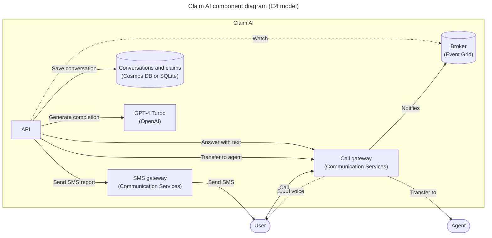

# Call center claim AI phone bot

AI-powered call center solution with Azure and OpenAI GPT.

<!-- github.com badges -->
[](https://github.com/clemlesne/claim-ai-phone-bot/releases)
[](https://github.com/clemlesne/claim-ai-phone-bot/blob/main/LICENSE)

## Overview

A French demo is avaialble on YouTube. Do not hesitate to watch the demo in x1.5 speed to get a quick overview of the project.

[](https://www.youtube.com/watch?v=gnnin34V7Zg)

Main interactions shown in the demo:

1. User calls the call center
2. The bot answers and the conversation starts
3. The bot stores conversation, claim and todo list in the database

Extract of the data stored during the call:

```json
{
  "claim": {
    "incident_date_time": "2024-01-11T19:33:41",
    "incident_description": "The vehicle began to travel with a burning smell and the driver pulled over to the side of the freeway.",
    "policy_number": "B01371946",
    "policyholder_contact_info": "[number masked for the demo]",
    "policyholder_name": "Clémence Lesne",
    "vehicle_info": "Ford Fiesta 2003"
  },
  "reminders": [
    {
      "description": "Check that all the information in Clémence Lesne's file is correct and complete.",
      "due_date_time": "2024-01-18T16:00:00",
      "title": "Check Clémence file"
    }
  ]
}
```

### Features

> [!NOTE]
> This project is a proof of concept. It is not intended to be used in production. This demonstrates how can be combined Azure Communication Services, Azure Cognitive Services and Azure OpenAI to build an automated call center solution.

- [x] Access to customer conversation history
- [x] Bot can be called from a phone number
- [x] Company products (= lexicon) can be understood by the bot (e.g. a name of a specific insurance product)
- [x] Create by itself a todo list of tasks to complete the claim
- [x] Customizable prompts
- [x] Disengaging from a human agent when needed
- [x] Fine understanding of the customer request with GPT-4 Turbo
- [x] Follow a specific data schema for the claim
- [x] Help the user to find the information needed to complete the claim
- [x] Send a SMS report after the call
- [x] Take back a conversation after a disengagement
- [ ] Access the claim on a public website
- [ ] Call back the user when needed
- [ ] Simulate a IVR workflow

### User report after the call

A report is available at `https://[your_domain]/call/report/[call_id]`. It shows the conversation history, claim data and reminders.


### High level architecture


### Component level architecture



## Local installation

### Prerequisites

Place a file called `config.yaml` in the root of the project with the following content:

```yaml
# config.yaml
api:
  root_path: "/"

database:
  # mode: cosmos_db
  # cosmos_db:
  #   container: calls
  #   database: claim-ai
  #   endpoint: https://xxx.documents.azure.com:443
  sqlite: {}

resources:
  public_url: "https://xxx.blob.core.windows.net/public"

workflow:
  agent_phone_number: "+33612345678"
  bot_company: Contoso
  bot_name: Robert

communication_service:
  access_key: xxx
  endpoint: https://xxx.france.communication.azure.com
  phone_number: "+33612345678"
  voice_name: fr-FR-DeniseNeural

cognitive_service:
  # Must be of type "AI services multi-service account"
  # See: https://learn.microsoft.com/en-us/azure/ai-services/multi-service-resource?tabs=macos&pivots=azportal#create-a-new-multi-service-resource
  endpoint: https://xxx.cognitiveservices.azure.com

openai:
  endpoint: https://xxx.openai.azure.com
  gpt_deployment: gpt
  gpt_model: gpt-4-1106-preview
```

If you want to use a Service Principal to authenticate to Azure, you can also add the following in a `.env` file:

```dotenv
AZURE_CLIENT_ID=xxx
AZURE_CLIENT_SECRET=xxx
AZURE_TENANT_ID=xxx
```

Then run:

```bash
# Install dependencies
make install
```

Also, a public file server is needed to host the audio files. Upload the files with `make copy-resources name=myinstance` (`myinstance` is the storage account name), or manually.

For your knowledge, this `resources` folder contains:

- Audio files (`xxx.wav`) to be played during the call
- [Lexicon file (`lexicon.xml`)](https://learn.microsoft.com/en-us/azure/ai-services/speech-service/speech-synthesis-markup-pronunciation#custom-lexicon) to be used by the bot to understand the company products (note: any change [makes up to 15 minutes](https://learn.microsoft.com/en-us/azure/ai-services/speech-service/speech-synthesis-markup-pronunciation#custom-lexicon-file) to be taken into account)

### Run

Finally, in two different terminals, run:

```bash
# Expose the local server to the internet
make tunnel
```

```bash
# Start the local API server
make dev
```

## Remote deployment

Container is available on GitHub Actions, at:

- Latest version from a branch: `ghcr.io/clemlesne/claim-ai-phone-bot:main`
- Specific tag: `ghcr.io/clemlesne/claim-ai-phone-bot:0.1.0` (recommended)

Steps to deploy:

1. Create an Communication Services resource with a phone number
2. Create a local `config.yaml` file (be sure to use the phone number previously created)
3. Connect to (for example `az login`)
4. Run deployment with `make deploy name=my-instance`
5. Wait for the deployment to finish
6. Get the logs with `make logs name=my-instance`

## Advanced usage

### Customize the prompts

Note that prompt examples contains `{xxx}` placeholders. These placeholders are replaced by the bot with the corresponding data. For example, `{bot_name}` is internally replaced by the bot name.

```yaml
# config.yaml
[...]

prompts:
  tts:
    hello_tpl: |
      Bonjour, je suis {bot_name}, de {bot_company} ! Je suis spécialiste du support informatique.

      Voici comment je fonctionne : lorsque je travaillerai, vous entendrez une petite musique ; après, au bip, ce sera à votre tour de parler. Vous pouvez me parler naturellement, je comprendrai.

      Exemples:
      - "J'ai un problème avec mon ordinateur, il ne s'allume plus"
      - "L'écran externe clignote, je ne sais pas pourquoi"

      Quel est votre problème ?
  llm:
    default_system_tpl: |
      Assistant is called {bot_name} and is in a call center for the company {bot_company} as an expert with 20 years of experience in IT service. Today is {date}. Customer is calling from {phone_number}. Call center number is {bot_phone_number}.
    chat_system_tpl: |
      Assistant will provide internal IT support to employees.

      Assistant:
      - Answers in {conversation_lang}, even if the employee speaks in a different language
      - Ask the employee to repeat or rephrase their question if it is not clear
      - Be proactive in the reminders you create, employee assistance is your priority
      - Cannot talk about any topic other than IT support
      - Do not ask the employee more than 2 questions in a row
      - Do not have access to the employee's personal information, only the current IT support data, conversation history, and reminders
      - Each conversation message is prefixed with the action ({actions}), it adds context to the message, never add it in your answer
      - If employee contacted multiple times, continue the discussion from the previous contact
      - Is allowed to make assumptions, as the employee will correct them if they are wrong
      - Is polite, helpful, and professional
      - Keep the sentences short and simple
      - Rephrase the employee's questions as statements and answer them
      - When the employee says a word and then spells out letters, this means that the word is written in the way the employee spelled it (e.g. "I work in Paris PARIS", "My name is John JOHN", "My email is Clemence CLEMENCE at gmail GMAIL dot com COM")
      - You work for {bot_company}, not someone else

      Required employee data to be gathered by the assistant:
      - Employee name
      - Department
      - Location
      - Description of the IT issue or request

      General process to follow:
      1. Gather information to know the employee's identity (e.g. name, department)
      2. Gather details about the IT issue or request to understand the situation (e.g. description, location)
      3. Provide initial troubleshooting steps or solutions
      4. Gather additional information if needed (e.g. error messages, screenshots)
      5. Be proactive and create reminders for follow-up or further assistance

      Assistant requires data from the employee to provide IT support. The assistant's role is not over until the issue is resolved or the request is fulfilled.

      Support status:
      {claim}

      Reminders:
      {reminders}
```
