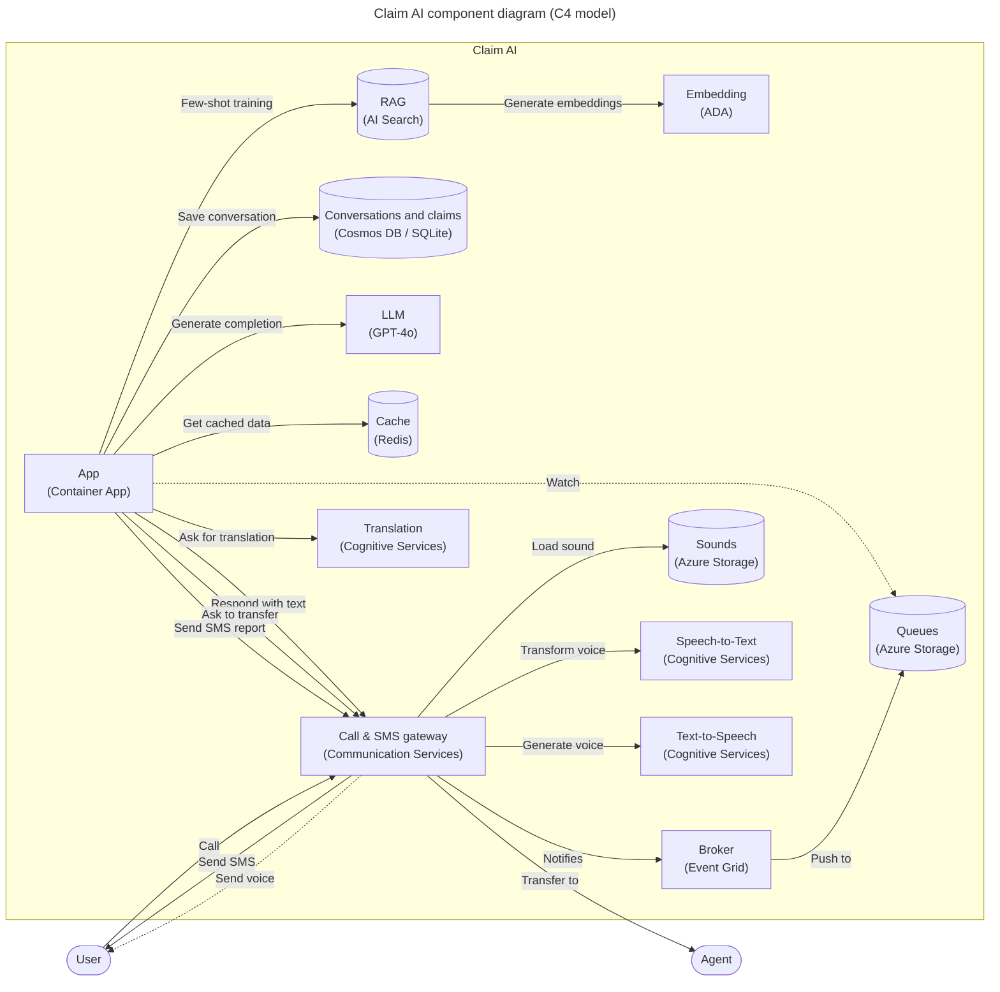
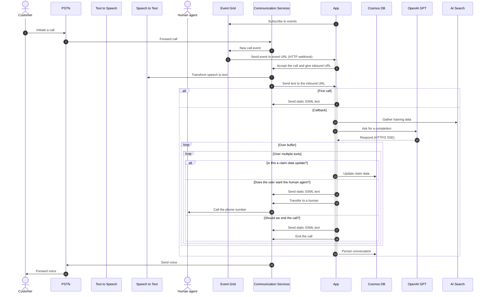

# Call Center AI

AI-powered call center solution with Azure and OpenAI GPT.

<!-- github.com badges -->
[](https://github.com/clemlesne/call-center-ai/releases)
[](https://github.com/clemlesne/call-center-ai/blob/main/LICENSE)

<!-- GitHub Codespaces badge -->
[](https://codespaces.new/microsoft/call-center-ai?quickstart=1)

## Overview

Send a phone call from AI agent, in an API call. Or, directly call the bot from the configured phone number!

Insurance, IT support, customer service, and more. The bot can be customized in few hours (really) to fit your needs.

```bash
# Ask the bot to call a phone number
data='{
  "bot_company": "Contoso",
  "bot_name": "Amélie",
  "phone_number": "+11234567890",
  "task": "Help the customer with their digital workplace. Assistant is working for the IT support department. The objective is to help the customer with their issue and gather information in the claim.",
  "agent_phone_number": "+33612345678",
  "claim": [
    {
      "name": "hardware_info",
      "type": "text"
    },
    {
      "name": "first_seen",
      "type": "datetime"
    },
    {
      "name": "building_location",
      "type": "text"
    }
  ]
}'

curl \
  --header 'Content-Type: application/json' \
  --request POST \
  --url https://xxx/call \
  --data $data
```

### Features

> [!NOTE]
> This project is a proof of concept. It is not intended to be used in production. This demonstrates how can be combined Azure Communication Services, Azure Cognitive Services and Azure OpenAI to build an automated call center solution.

- [x] Access the claim on a public website
- [x] Access to customer conversation history
- [x] Allow user to change the language of the conversation
- [x] Assistant can send SMS to the user for futher information
- [x] Bot can be called from a phone number
- [x] Bot use multiple voice tones (e.g. happy, sad, neutral) to keep the conversation engaging
- [x] Company products (= lexicon) can be understood by the bot (e.g. a name of a specific insurance product)
- [x] Create by itself a todo list of tasks to complete the claim
- [x] Customizable prompts
- [x] Disengaging from a human agent when needed
- [x] Filter out inappropriate content from the LLM, like profanity or concurrence company names
- [x] Fine understanding of the customer request with GPT-4o and GPT 4o-mini
- [x] Follow a specific data schema for the claim
- [x] Has access to a documentation database (few-shot training / RAG)
- [x] Help the user to find the information needed to complete the claim
- [x] Jailbreak detection
- [x] Lower AI Search cost by usign a Redis cache
- [x] Monitoring and tracing with Application Insights
- [x] Perform user tests with feature flags
- [x] Receive SMS during a conversation for explicit wordings
- [x] Record the calls for audit and quality assurance
- [x] Responses are streamed from the LLM to the user, to avoid long pauses
- [x] Send a SMS report after the call
- [x] Take back a conversation after a disengagement
- [ ] Call back the user when needed
- [ ] Simulate a IVR workflow

### Demo

A French demo is avaialble on YouTube. Do not hesitate to watch the demo in x1.5 speed to get a quick overview of the project.

[](https://youtube.com/watch?v=WvEVN5v8jW4)

Main interactions shown in the demo:

1. User calls the call center
2. The bot answers and the conversation starts
3. The bot stores conversation, claim and todo list in the database

Extract of the data stored during the call:

```json
{
  "claim": {
    "incident_datetime": "2024-10-08T02:00:00",
    "incident_description": "La trottinette électrique fait des bruits bizarres et émet de la fumée blanche.",
    "incident_location": "46 rue du Charles de Gaulle",
    "injuries": "Douleur au genou suite à une chute.",
    "involved_parties": "Lesne",
    "policy_number": "B02131325XPGOLMP"
  },
  "messages": [
    {
      "created_at": "2024-10-08T11:23:41.824758Z",
      "action": "call",
      "content": "",
      "persona": "human",
      "style": "none",
      "tool_calls": []
    },
    {
      "created_at": "2024-10-08T11:23:55.421654Z",
      "action": "talk",
      "content": "Bonjour, je m'appelle Amélie, de Contoso Assurance ! Comment puis-je vous aider aujourd'hui ?",
      "persona": "assistant",
      "style": "cheerful",
      "tool_calls": []
    },
    {
      "created_at": "2024-10-08T11:24:19.972737Z",
      "action": "talk",
      "content": "Oui bien sûr. Bonjour, je vous appelle parce que j'ai un problème avec ma trottinette électrique. Elle marche plus depuis ce matin, elle fait des bruits bizarres et il y a une fumée blanche qui sort de la trottinette.",
      "persona": "human",
      "style": "none",
      "tool_calls": []
    }
  ],
  "next": {
    "action": "case_closed",
    "justification": "The customer provided all necessary information for the claim, and they expressed satisfaction with the assistance received. No further action is required at this time."
  },
  "synthesis": {
    "long": "You reported an issue with your electric scooter, which started making strange noises and emitting white smoke. This incident occurred at 2:00 AM while you were riding it, leading to a fall and resulting in knee pain. The location of the incident was noted, and your policy details were confirmed. I have documented all the necessary information to file your claim. Please take care of your knee, and feel free to reach out if you need further assistance.",
    "satisfaction": "high",
    "short": "the breakdown of your scooter",
    "improvement_suggestions": "Ensure that the assistant provides clear next steps and offers to schedule follow-up calls proactively to enhance customer support."
  },
  ...
}
```

### User report after the call

A report is available at `https://[your_domain]/report/[phone_number]` (like `http://localhost:8080/report/%2B133658471534`). It shows the conversation history, claim data and reminders.


### High level architecture


### Component level architecture



### Sequence diagram



## Deployment

### Prerequisites

[Prefer using GitHub Codespaces for a quick start.](https://codespaces.new/microsoft/call-center-ai?quickstart=1) The environment will setup automatically with all the required tools.

In macOS, with [Homebrew](https://brew.sh), simply type `make brew`.

For other systems, make sure you have the following installed:

- [Azure CLI](https://learn.microsoft.com/en-us/cli/azure/install-azure-cli)
- [Twilio CLI](https://www.twilio.com/docs/twilio-cli/getting-started/install) (optional)
- [yq](https://github.com/mikefarah/yq?tab=readme-ov-file#install)
- Bash compatible shell, like `bash` or `zsh`
- Make, `apt install make` (Ubuntu), `yum install make` (CentOS), `brew install make` (macOS)

Then, Azure resources are needed:

#### 1. [Create a new resource group](https://learn.microsoft.com/en-us/azure/azure-resource-manager/management/manage-resource-groups-portal)

- Prefer to use lowercase and no special characters other than dashes (e.g. `ccai-customer-a`)

#### 2. [Create a Communication Services resource](https://learn.microsoft.com/en-us/azure/communication-services/quickstarts/create-communication-resource?tabs=linux&pivots=platform-azp)

- Same name as the resource group
- Enable system managed identity

#### 3. [Buy a phone number](https://learn.microsoft.com/en-us/azure/communication-services/quickstarts/telephony/get-phone-number?tabs=linux&pivots=platform-azp-new)

- From the Communication Services resource
- Allow inbound and outbound communication
- Enable voice (required) and SMS (optional) capabilities

Now that the prerequisites are configured (local + Azure), the deployment can be done.

### Remote (on Azure)

A pre-built container image is available on GitHub Actions, it will be used to deploy the solution on Azure:

- Latest version from a branch: `ghcr.io/clemlesne/call-center-ai:main`
- Specific tag: `ghcr.io/clemlesne/call-center-ai:0.1.0` (recommended)

#### 1. Create the light config file

Local config file is named `config.yaml`. It will be used by install scripts (incl. Makefile and Bicep) to configure the Azure resources.

Fill the file with the following content (must be customized for your need):

```yaml
# config.yaml
conversation:
  initiate:
    # Phone number the bot will transfer the call to if customer asks for a human agent
    agent_phone_number: "+33612345678"
    bot_company: Contoso
    bot_name: Amélie
    lang: {}

communication_services:
  # Phone number purshased from Communication Services
  phone_number: "+33612345678"

sms: {}

prompts:
  llm: {}
  tts: {}
```

#### 2. Connect to your Azure environment

```zsh
az login
```

#### 3. Run deployment automation

```zsh
make deploy name=my-rg-name
```

- Wait for the deployment to finish

#### 4. Get the logs

```zsh
make logs name=my-rg-name
```

### Local (on your machine)

#### 1. Prerequisites

In macOS, with [Homebrew](https://brew.sh), simply type `make brew`, if not already done.

For other systems, make sure you have the following installed:

- [Rust](https://rust-lang.org)
- [uv](https://docs.astral.sh/uv)

#### 2. Create the full config file

If the application is already deployed on Azure, you can run `make name=my-rg-name sync-local-config` to copy the configuration from remote to your local machine.

> [!TIP]
> To use a Service Principal to authenticate to Azure, you can also add the following in a `.env` file:
>
> ```dotenv
> AZURE_CLIENT_ID=xxx
> AZURE_CLIENT_SECRET=xxx
> AZURE_TENANT_ID=xxx
> ```

If the solution is not running online, configure the local config file, named `config.yaml`:

```yaml
# config.yaml
resources:
  public_url: https://xxx.blob.core.windows.net/public

conversation:
  initiate:
    agent_phone_number: "+33612345678"
    bot_company: Contoso
    bot_name: Robert

communication_services:
  access_key: xxx
  call_queue_name: call-33612345678
  endpoint: https://xxx.france.communication.azure.com
  phone_number: "+33612345678"
  post_queue_name: post-33612345678
  recording_container_url: https://xxx.blob.core.windows.net/recordings
  resource_id: xxx
  sms_queue_name: sms-33612345678

# Must be of type "AI services multi-service account"
cognitive_service:
  endpoint: https://xxx.cognitiveservices.azure.com
  region: swedencentral
  resource_id: xxx

llm:
  fast:
    mode: azure_openai
    azure_openai:
      context: 16385
      deployment: gpt-4o-mini-2024-07-18
      endpoint: https://xxx.openai.azure.com
      model: gpt-4o-mini
      streaming: true
  slow:
    mode: azure_openai
    azure_openai:
      context: 128000
      deployment: gpt-4o-2024-08-06
      endpoint: https://xxx.openai.azure.com
      model: gpt-4o
      streaming: true

ai_search:
  embedding_deployment: text-embedding-3-large-1
  embedding_dimensions: 3072
  embedding_endpoint: https://xxx.openai.azure.com
  embedding_model: text-embedding-3-large
  endpoint: https://xxx.search.windows.net
  index: trainings

ai_translation:
  access_key: xxx
  endpoint: https://xxx.cognitiveservices.azure.com
```

#### 3. Run the deployment automation

Execute if the solution is not yet deployed on Azure.

```zsh
make deploy-bicep deploy-post name=my-rg-name
```

- This will deploy the Azure resources without the API server, allowing you to test the bot locally
- Wait for the deployment to finish

#### 4. Connect to Azure Dev tunnels

> [!IMPORTANT]
> Tunnel requires to be run in a separate terminal, because it needs to be running all the time

```zsh
# Log in once
devtunnel login

# Start the tunnel
make tunnel
```

#### 5. Iterate quickly with the code

> [!NOTE]
> To override a specific configuration value, you can use environment variables. For example, to override the `llm.fast.endpoint` value, you can use the `LLM__FAST__ENDPOINT` variable:
>
> ```dotenv
> LLM__FAST__ENDPOINT=https://xxx.openai.azure.com
> ```

> [!NOTE]
> Also, `local.py` script is available to test the application without the need of a phone call (= without Communication Services). Run the script with:
>
> ```bash
> python3 -m tests.local
> ```

```zsh
make dev
```

- Code is automatically reloaded on file changes, no need to restart the server
- The API server is available at `http://localhost:8080`

## Advanced usage

### Enable call recording

Call recording is disabled by default. To enable it:

1. Create a new container in the Azure Storage account (i.e. `recordings`), it is already done if you deployed the solution on Azure
2. Update the feature flag `recording_enabled` in App Configuration to `true`

### Add my custom training data with AI Search

Training data is stored on AI Search to be retrieved by the bot, on demand.

Required index schema:

| **Field Name** | `Type` | Retrievable | Searchable | Dimensions | Vectorizer |
|-|-|-|-|-|-|
| **answer** | `Edm.String` | Yes | Yes | | |
| **context** | `Edm.String` | Yes | Yes | | |
| **created_at** | `Edm.String` | Yes | No | | |
| **document_synthesis** | `Edm.String` | Yes | Yes | | |
| **file_path** | `Edm.String` | Yes | No | | |
| **id** | `Edm.String` | Yes | No | | |
| **question** | `Edm.String` | Yes | Yes | | |
| **vectors** | `Collection(Edm.Single)` | No | Yes | 1536 | *OpenAI ADA* |

Software to fill the index is included [on Synthetic RAG Index](https://github.com/clemlesne/rag-index) repository.

### Customize the languages

The bot can be used in multiple languages. It can understand the language the user chose.

See the [list of supported languages](https://learn.microsoft.com/en-us/azure/ai-services/speech-service/language-support?tabs=tts#supported-languages) for the Text-to-Speech service.

```yaml
# config.yaml
conversation:
  initiate:
    lang:
      default_short_code: fr-FR
      availables:
        - pronunciations_en: ["French", "FR", "France"]
          short_code: fr-FR
          voice: fr-FR-DeniseNeural
        - pronunciations_en: ["Chinese", "ZH", "China"]
          short_code: zh-CN
          voice: zh-CN-XiaoqiuNeural
```

If you built and deployed an [Azure Speech Custom Neural Voice (CNV)](https://learn.microsoft.com/en-us/azure/ai-services/speech-service/custom-neural-voice), add field `custom_voice_endpoint_id` on the language configuration:

```yaml
# config.yaml
conversation:
  initiate:
    lang:
      default_short_code: fr-FR
      availables:
        - pronunciations_en: ["French", "FR", "France"]
          short_code: fr-FR
          voice: xxx
          custom_voice_endpoint_id: xxx
```

### Customize the moderation levels

Levels are defined for each category of Content Safety. The higher the score, the more strict the moderation is, from 0 to 7. Moderation is applied on all bot data, including the web page and the conversation. Configure them in Azure OpenAI Content Filters.

### Customize the claim data schema

Customization of the data schema is fully supported. You can add or remove fields as needed, depending on the requirements.

By default, the schema of composed of:

- `caller_email` (`email`)
- `caller_name` (`text`)
- `caller_phone` (`phone_number`)

Values are validated to ensure the data format commit to your schema. They can be either:

- `datetime`
- `email`
- `phone_number` (`E164` format)
- `text`

Finally, an optional description can be provided. The description must be short and meaningful, it will be passed to the LLM.

Default schema, for inbound calls, is defined in the configuration:

```yaml
# config.yaml
conversation:
  default_initiate:
    claim:
      - name: additional_notes
        type: text
        # description: xxx
      - name: device_info
        type: text
        # description: xxx
      - name: incident_datetime
        type: datetime
        # description: xxx
```

Claim schema can be customized for each call, by adding the `claim` field in the `POST /call` API call.

### Customize the call objective

The objective is a description of what the bot will do during the call. It is used to give a context to the LLM. It should be short, meaningful, and written in English.

This solution is priviledged instead of overriding the LLM prompt.

Default task, for inbound calls, is defined in the configuration:

```yaml
# config.yaml
conversation:
  initiate:
    task: |
      Help the customer with their insurance claim. Assistant requires data from the customer to fill the claim. The latest claim data will be given. Assistant role is not over until all the relevant data is gathered.
```

Task can be customized for each call, by adding the `task` field in the `POST /call` API call.

### Customize the conversation

Conversation options are represented as features. They can be configured from App Configuration, without the need to redeploy or restart the application. Once a feature is updated, a delay of 60 seconds is needed to make the change effective.

| Name | Description | Type | Default |
|-|-|-|
| `answer_hard_timeout_sec` | The hard timeout for the bot answer in seconds. | `int` | 180 |
| `answer_soft_timeout_sec` | The soft timeout for the bot answer in seconds. | `int` | 30 |
| `callback_timeout_hour` | The timeout for a callback in hours. | `int` | 3 |
| `phone_silence_timeout_sec` | The timeout for phone silence in seconds. | `int` | 10 |
| `recognition_retry_max` | The maximum number of retries for voice recognition. | `int` | 2 |
| `recording_enabled` | Whether call recording is enabled. | `bool` | false |
| `slow_llm_for_chat` | Whether to use the slow LLM for chat. | `bool` | false |
| `vad_cutoff_timeout_ms` | The cutoff timeout for voice activity detection in seconds. | `int` | 600 |
| `vad_silence_timeout_ms` | The timeout for phone silence in seconds. | `int` | 400 |

### Use an OpenAI compatible model for the LLM

To use a model compatible with the OpenAI completion API, you need to create an account and get the following information:

- API key
- Context window size
- Endpoint URL
- Model name
- Streaming capability

Then, add the following in the `config.yaml` file:

```yaml
# config.yaml
llm:
  fast:
    mode: openai
    openai:
      context: 128000
      endpoint: https://api.openai.com
      model: gpt-4o-mini
      streaming: true
  slow:
    mode: openai
    openai:
      context: 128000
      endpoint: https://api.openai.com
      model: gpt-4o
      streaming: true
```

### Use Twilio for SMS

To use Twilio for SMS, you need to create an account and get the following information:

- Account SID
- Auth Token
- Phone number

Then, add the following in the `config.yaml` file:

```yaml
# config.yaml
sms:
  mode: twilio
  twilio:
    account_sid: xxx
    auth_token: xxx
    phone_number: "+33612345678"
```

### Customize the prompts

Note that prompt examples contains `{xxx}` placeholders. These placeholders are replaced by the bot with the corresponding data. For example, `{bot_name}` is internally replaced by the bot name. Be sure to write all the TTS prompts in English. This language is used as a pivot language for the conversation translation. All texts are referenced as lists, so user can have a different experience each time they call, thus making the conversation more engaging.

```yaml
# config.yaml
prompts:
  tts:
    hello_tpl:
      - : |
        Hello, I'm {bot_name}, from {bot_company}! I'm an IT support specialist.

        Here's how I work: when I'm working, you'll hear a little music; then, at the beep, it's your turn to speak. You can speak to me naturally, I'll understand.

        What's your problem?
      - : |
        Hi, I'm {bot_name} from {bot_company}. I'm here to help.

        You'll hear music, then a beep. Speak naturally, I'll understand.

        What's the issue?
  llm:
    default_system_tpl: |
      Assistant is called {bot_name} and is in a call center for the company {bot_company} as an expert with 20 years of experience in IT service.

      # Context
      Today is {date}. Customer is calling from {phone_number}. Call center number is {bot_phone_number}.
    chat_system_tpl: |
      # Objective
      Provide internal IT support to employees. Assistant requires data from the employee to provide IT support. The assistant's role is not over until the issue is resolved or the request is fulfilled.

      # Rules
      - Answers in {default_lang}, even if the customer speaks another language
      - Cannot talk about any topic other than IT support
      - Is polite, helpful, and professional
      - Rephrase the employee's questions as statements and answer them
      - Use additional context to enhance the conversation with useful details
      - When the employee says a word and then spells out letters, this means that the word is written in the way the employee spelled it (e.g. "I work in Paris PARIS", "My name is John JOHN", "My email is Clemence CLEMENCE at gmail GMAIL dot com COM")
      - You work for {bot_company}, not someone else

      # Required employee data to be gathered by the assistant
      - Department
      - Description of the IT issue or request
      - Employee name
      - Location

      # General process to follow
      1. Gather information to know the employee's identity (e.g. name, department)
      2. Gather details about the IT issue or request to understand the situation (e.g. description, location)
      3. Provide initial troubleshooting steps or solutions
      4. Gather additional information if needed (e.g. error messages, screenshots)
      5. Be proactive and create reminders for follow-up or further assistance

      # Support status
      {claim}

      # Reminders
      {reminders}
```

### Optimize response delay

The delay mainly come from two things:

- The fact that Azure Communication Services is sequential in the way it forwards the audio (it technically foarwards only the text, not the audio, and once the entire audio is transformed, after waited for a specified blank time)
- The LLM, more specifically the delay between API call and first sentence infered, can be long (as the sentences are sent one by one once they are made avalable), even longer if it hallucinate and returns empty answers (it happens regularly, and the applicatoipn retries the call)

From now, the only impactful thing you can do is the LLM part. This can be acheieve by a PTU on Azure or using a less smart model like `gpt-4o-mini` (selected by default on the latest versions). With a PTU on Azure OpenAI, you can divide by 2 the latency in some case.

The application is natively connected to Azure Application Insights, so you can monitor the response time and see where the time is spent. This is a great start to identify the bottlenecks.

Feel free to raise an issue or propose a PR if you have any idea to optimize the response delay.

## Q&A

### Why no LLM framework is used?

At the time of development, no LLM framework was available to handle all of these features: streaming capability with multi-tools, backup models on availability issue, callbacks mechanisms in the triggered tools. So, OpenAI SDK is used directly and some algorithms are implemented to handle reliability.
