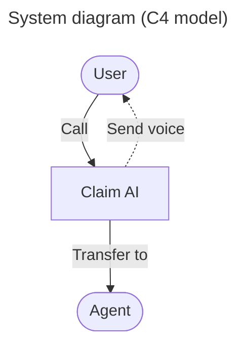
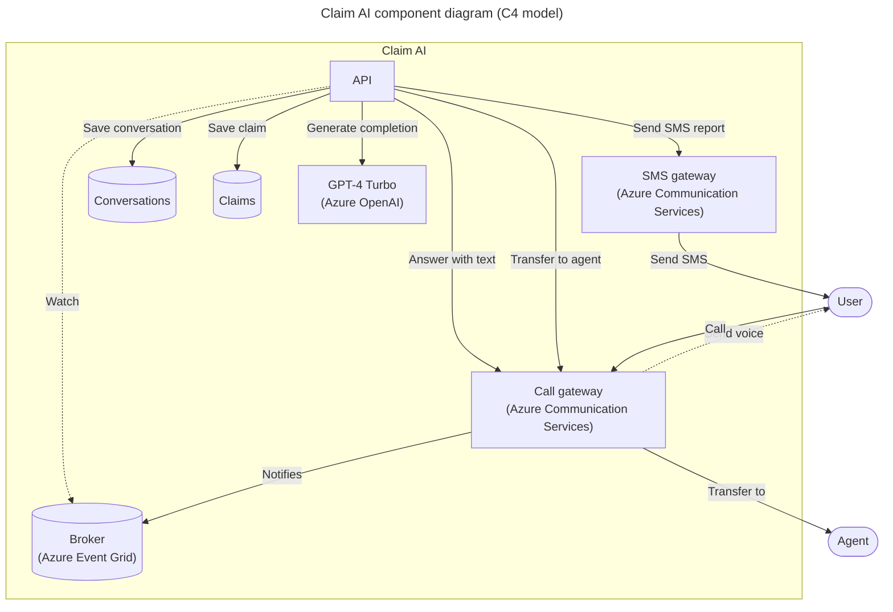

# Call center claim AI phone bot

AI-powered call center solution with Azure and OpenAI GPT.

<!-- github.com badges -->
[](https://github.com/clemlesne/claim-ai-phone-bot/releases)
[](https://github.com/clemlesne/claim-ai-phone-bot/blob/main/LICENSE)

## Overview

A French demo is avaialble on YouTube. Do not hesitate to watch the demo in x1.5 speed to get a quick overview of the project.

[](https://www.youtube.com/watch?v=gnnin34V7Zg)

Main interactions shown in the demo:

1. User calls the call center
2. The bot answers and the conversation starts
3. The bot stores conversation, claim and todo list in the database

Extract of the data stored during the call:

```json
{
  "claim": {
    "incident_date_time": "2024-01-11T19:33:41",
    "incident_description": "The vehicle began to travel with a burning smell and the driver pulled over to the side of the freeway.",
    "policy_number": "B01371946",
    "policyholder_contact_info": "[number masked for the demo]",
    "policyholder_name": "Clémence Lesne",
    "vehicle_info": "Ford Fiesta 2003"
  },
  "reminders": [
    {
      "description": "Check that all the information in Clémence Lesne's file is correct and complete.",
      "due_date_time": "2024-01-18T16:00:00",
      "title": "Check Clémence file"
    }
  ]
}
```

### Features

> [!NOTE]
> This project is a proof of concept. It is not intended to be used in production. This demonstrates how can be combined Azure Communication Services, Azure Cognitive Services and Azure OpenAI to build an automated call center solution.

- [x] Access to customer conversation history
- [x] Bot can be called from a phone number
- [x] Company products (= lexicon) can be understood by the bot (e.g. a name of a specific insurance product)
- [x] Create by itself a todo list of tasks to complete the claim
- [x] Disengaging from a human agent when needed
- [x] Fine understanding of the customer request with GPT-4 Turbo
- [x] Follow a specific data schema for the claim
- [x] Help the user to find the information needed to complete the claim
- [x] Send a SMS report after the call
- [x] Take back a conversation after a disengagement
- [ ] Access the claim on a public website
- [ ] Call back the user when needed
- [ ] Simulate a IVR workflow

### High level architecture



### Component level architecture



## Local installation

### Prerequisites

Place a file called `config.yaml` in the root of the project with the following content:

```yaml
# config.yaml
api:
  root_path: "/"

monitoring:
  logging:
    app_level: INFO
    sys_level: WARN

resources:
  public_url: "https://xxx.blob.core.windows.net/public"

workflow:
  agent_phone_number: "+33612345678"
  bot_company: Contoso
  bot_name: Robert

communication_service_call:
  access_key: xxx
  endpoint: https://xxx.france.communication.azure.com
  phone_number: "+33612345678"
  voice_name: fr-FR-DeniseNeural

cognitive_service:
  # Must be of type "Azure AI services multi-service account"
  # See: https://learn.microsoft.com/en-us/azure/ai-services/multi-service-resource?tabs=macos&pivots=azportal#create-a-new-multi-service-resource
  endpoint: https://xxx.cognitiveservices.azure.com

openai:
  endpoint: https://xxx.openai.azure.com
  gpt_deployment: gpt-4-turbo
  gpt_model: gpt-4-1106-preview

eventgrid:
  resource_group: claim-ai-poc
  subscription_id: xxx
  system_topic: claim-ai-poc
```

If you want to use a Service Principal to authenticate to Azure, you can also add the following in a `.env` file:

```dotenv
AZURE_CLIENT_ID=xxx
AZURE_CLIENT_SECRET=xxx
AZURE_TENANT_ID=xxx
```

Then run:

```bash
# Install dependencies
make install
```

Also, a public file server is needed to host the audio files.

For this, you can use Azure Blob Storage. In that case, content of the project folder `resources` requires to be uploaded to the public container `$web` of the storage account. This folder contains:

- Audio files (`xxx.wav`) to be played during the call
- [Lexicon file (`lexicon.xml`)](https://learn.microsoft.com/en-us/azure/ai-services/speech-service/speech-synthesis-markup-pronunciation#custom-lexicon) to be used by the bot to understand the company products (note: any change [makes up to 15 minutes](https://learn.microsoft.com/en-us/azure/ai-services/speech-service/speech-synthesis-markup-pronunciation#custom-lexicon-file) to be taken into account)

### Run

Finally, in two different terminals, run:

```bash
# Expose the local server to the internet
make tunnel
```

```bash
# Start the local API server
make dev
```

## Remote deployment

Container is available on GitHub Actions, at:

- Latest version from a branch: `ghcr.io/clemlesne/claim-ai-phone-bot:main`
- Specific tag: `ghcr.io/clemlesne/claim-ai-phone-bot:0.1.0` (recommended)
