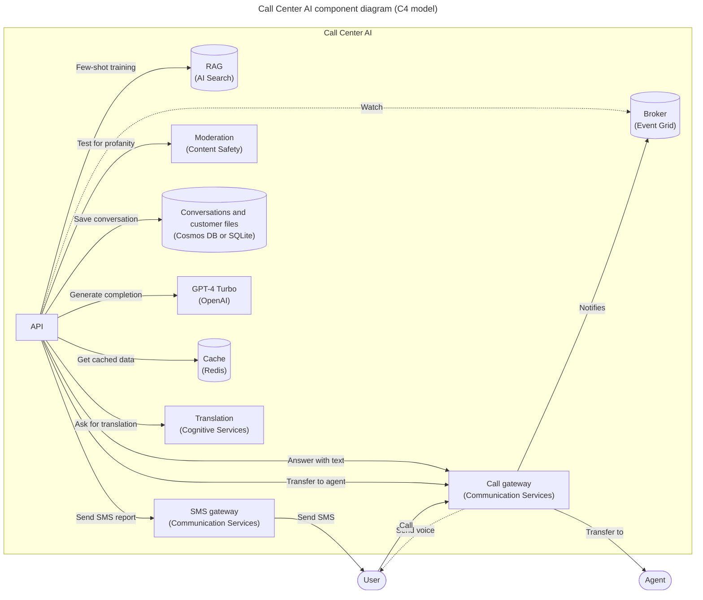
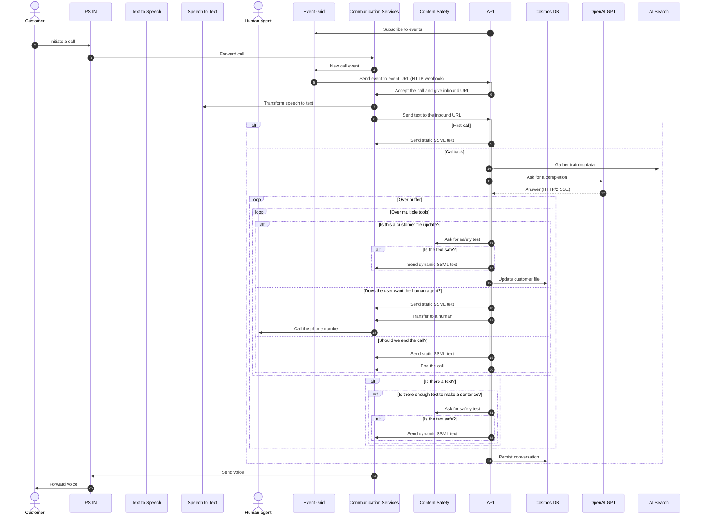

# Call Center AI

AI-powered call center solution with Azure and OpenAI GPT.

<!-- github.com badges -->
[](https://github.com/clemlesne/call-center-ai/releases)
[](https://github.com/clemlesne/call-center-ai/blob/main/LICENSE)

## Overview

Send a phone call from AI agent, in an API call. Or, directly call the bot from the configured phone number!

```bash
# Ask the bot to call a phone number
data='{
  "bot_company": "Contoso Insurance",
  "bot_name": "Alice",
  "phone_number": "+33622222222",
  "task": "Assistant will help the customer with their insurance claim. Assistant requires data from the customer to fill the claim. Claim data is located in the customer file. Assistant role is not over until all the relevant data is gathered.",
  "transfer_phone_number": "+33611111111",
  "customer_file": [
    {
      "name": "incident_location",
      "type": "text"
    },
    {
      "name": "incident_datetime",
      "type": "datetime"
    },
    {
      "name": "whitness_number",
      "type": "phone_number"
    }
  ],
}'

curl \
  --header 'Content-Type: application/json' \
  --request POST \
  --url https://xxx/call \
  --data $data
```

### Features

> [!NOTE]
> This project is a proof of concept. It is not intended to be used in production. This demonstrates how can be combined Azure Communication Services, Azure Cognitive Services and Azure OpenAI to build an automated call center solution.

- [x] Access the call on a public website
- [x] Access to customer conversation history
- [x] Allow user to change the language of the conversation
- [x] Bot can be called from a phone number
- [x] Bot use multiple voice tones (e.g. happy, sad, neutral) to keep the conversation engaging
- [x] Company products (= lexicon) can be understood by the bot (e.g. a name of a specific insurance product)
- [x] Create by itself a todo list of tasks to complete the customer file
- [x] Customizable prompts
- [x] Disengaging from a human agent when needed
- [x] Filter out inappropriate content from the LLM, like profanity or concurrence company names
- [x] Fine understanding of the customer request with GPT-4 Turbo
- [x] Follow a specific data schema for the customer file
- [x] Has access to a documentation database (few-shot training / RAG)
- [x] Help the user to find the information needed to complete the CMR entry
- [x] Lower AI Search cost by usign a Redis cache
- [x] Monitoring and tracing with Application Insights
- [x] Responses are streamed from the LLM to the user, to avoid long pauses
- [x] Send a SMS report after the call
- [x] Take back a conversation after a disengagement
- [ ] Call back the user when needed
- [ ] Simulate a IVR workflow

### Demo

A French demo is avaialble on YouTube. Do not hesitate to watch the demo in x1.5 speed to get a quick overview of the project.

[](https://youtube.com/watch?v=4r5s-NZ9CuY)

Main interactions shown in the demo:

1. User calls the call center
2. The bot answers and the conversation starts
3. The bot stores conversation, customer file and todo list in the database

Extract of the data stored during a call:

```json
{
  "customer_file": {
    "incident_datetime": "2024-01-11T19:33:41",
    "incident_description": "The vehicle began to travel with a burning smell and the driver pulled over to the side of the freeway.",
    "policy_number": "B01371946",
    "caller_phone": "[number masked for the demo]",
    "caller_name": "Clémence Lesne",
    "vehicle_info": "Ford Fiesta 2003"
  },
  "reminders": [
    {
      "description": "Check that all the information in Clémence Lesne's file is correct and complete.",
      "due_date_time": "2024-01-18T16:00:00",
      "title": "Check Clémence file"
    }
  ]
}
```

### User report after the call

A report is available at `https://[your_domain]/report/[phone_number]` (like `http://localhost:8080/report/%2B133658471534`). It shows the conversation history, customer file and reminders.


### High level architecture


### Component level architecture



### Sequence diagram



## Remote deployment

Container is available on GitHub Actions, at:

- Latest version from a branch: `ghcr.io/clemlesne/call-center-ai:main`
- Specific tag: `ghcr.io/clemlesne/call-center-ai:0.1.0` (recommended)

Create a local `config.yaml` file (most of the fields are filled automatically by the deployment script):

```yaml
# config.yaml
workflow:
  transfer_phone_number: "+33612345678"
  bot_company: Contoso
  bot_name: Robert
  lang: {}

communication_services:
  phone_number: "+33612345678"

sms: {}

prompts:
  llm: {}
  tts: {}
```

Steps to deploy:

1. Create an Communication Services resource, a Phone Number with inbound call capability, make sure the resource have a managed identity
2. Create the local `config.yaml` file (like the example above)
3. Connect to your Azure environment (e.g. `az login`)
4. Run deployment with `make deploy name=my-instance`
5. Wait for the deployment to finish (if it fails for a `'null' not found` error, retry the command)
6. Link the AI multi-service account named `[my-instance]-communication` to the Communication Services resource
7. Create a AI Search index named `trainings`

Get the logs with `make logs name=my-instance`.

## Local installation

### Prerequisites

Place a file called `config.yaml` in the root of the project with the following content:

```yaml
# config.yaml
monitoring:
  application_insights:
    connection_string: xxx

resources:
  public_url: "https://xxx.blob.core.windows.net/public"

workflow:
  default_initiate:
    bot_company: Contoso
    bot_name: Robert
    transfer_phone_number: "+33612345678"

communication_services:
  access_key: xxx
  endpoint: https://xxx.france.communication.azure.com
  phone_number: "+33612345678"

cognitive_service:
  # Must be of type "AI services multi-service account"
  endpoint: https://xxx.cognitiveservices.azure.com

llm:
  backup:
    mode: azure_openai
    azure_openai:
      api_key: xxx
      context: 16385
      deployment: gpt-35-turbo-0125
      endpoint: https://xxx.openai.azure.com
      model: gpt-35-turbo
      streaming: true
  primary:
    mode: azure_openai
    azure_openai:
      api_key: xxx
      context: 128000
      deployment: gpt-4-0125-preview
      endpoint: https://xxx.openai.azure.com
      model: gpt-4
      streaming: true

ai_search:
  access_key: xxx
  endpoint: https://xxx.search.windows.net
  index: trainings
  semantic_configuration: default

content_safety:
  access_key: xxx
  endpoint: https://xxx.cognitiveservices.azure.com
```

To use a Service Principal to authenticate to Azure, you can also add the following in a `.env` file:

```dotenv
AZURE_CLIENT_ID=xxx
AZURE_CLIENT_SECRET=xxx
AZURE_TENANT_ID=xxx
```

To override a specific configuration value, you can also use environment variables. For example, to override the `openai.endpoint` value, you can use the `OPENAI__ENDPOINT` variable:

```dotenv
OPENAI__ENDPOINT=https://xxx.openai.azure.com
```

Then run:

```bash
# Install dependencies
make install
```

Also, a public file server is needed to host the audio files. Upload the files with `make copy-resources name=myinstance` (`myinstance` is the storage account name), or manually.

For your knowledge, this `resources` folder contains:

- Audio files (`xxx.wav`) to be played during the call
- [Lexicon file (`lexicon.xml`)](https://learn.microsoft.com/en-us/azure/ai-services/speech-service/speech-synthesis-markup-pronunciation#custom-lexicon) to be used by the bot to understand the company products (note: any change [makes up to 15 minutes](https://learn.microsoft.com/en-us/azure/ai-services/speech-service/speech-synthesis-markup-pronunciation#custom-lexicon-file) to be taken into account)

### Run

Finally, in two different terminals, run:

```bash
# Expose the local server to the internet
make tunnel
```

```bash
# Start the local API server
make dev
```

## Advanced usage

### Add my custom training data with AI Search

Training data is stored on AI Search to be retrieved by the bot, on demand.

Required index schema:

| **Field Name** | `Type` | Retrievable | Searchable | Dimensions | Vectorizer |
|-|-|-|-|-|-|
| **id** | `Edm.String` | Yes | No | | |
| **content** | `Edm.String` | Yes | Yes | | |
| **source_uri** | `Edm.String` | Yes | No | | |
| **title** | `Edm.String` | Yes | Yes| | |
| **vectors** | `Collection(Edm.Single)` | No | No | 1536 | *OpenAI ADA* |

An exampe is [available at `examples/import-training.ipynb`](examples/import-training.ipynb). It shows how to import training data from a PDF files dataset.

### Customize the prompts

Note that prompt examples contains `{xxx}` placeholders. These placeholders are replaced by the bot with the corresponding data. For example, `{bot_name}` is internally replaced by the bot name.

Be sure to write all the TTS prompts in English. This language is used as a pivot language for the conversation translation.

```yaml
# config.yaml
[...]

prompts:
  tts:
    hello_tpl: |
      Hello, I'm {bot_name}, from {bot_company}! I'm an IT support specialist.

      Here's how I work: when I'm working, you'll hear a little music; then, at the beep, it's your turn to speak. You can speak to me naturally, I'll understand.

      Examples:
      - "I've got a problem with my computer, it won't turn on".
      - "The external screen is flashing, I don't know why".

      What's your problem?
  llm:
    default_system_tpl: |
      Assistant is called {bot_name} and is in a call center for the company {bot_company} as an expert with 20 years of experience in IT service.

      # Context
      Today is {date}. Customer is calling from {phone_number}. Call center number is {bot_phone_number}.
    chat_system_tpl: |
      # Objective
      Assistant will provide internal IT support to employees. Assistant requires data from the employee to provide IT support. The assistant's role is not over until the issue is resolved or the request is fulfilled.

      # Rules
      - Answers in {default_lang}, even if the customer speaks another language
      - Cannot talk about any topic other than IT support
      - Is polite, helpful, and professional
      - Rephrase the employee's questions as statements and answer them
      - Use additional context to enhance the conversation with useful details
      - When the employee says a word and then spells out letters, this means that the word is written in the way the employee spelled it (e.g. "I work in Paris PARIS", "My name is John JOHN", "My email is Clemence CLEMENCE at gmail GMAIL dot com COM")
      - You work for {bot_company}, not someone else

      # Required employee data to be gathered by the assistant
      - Department
      - Description of the IT issue or request
      - Employee name
      - Location

      # General process to follow
      1. Gather information to know the employee's identity (e.g. name, department)
      2. Gather details about the IT issue or request to understand the situation (e.g. description, location)
      3. Provide initial troubleshooting steps or solutions
      4. Gather additional information if needed (e.g. error messages, screenshots)
      5. Be proactive and create reminders for follow-up or further assistance

      # Customer file
      {customer_file}

      # Reminders
      {reminders}
```

### Customize the languages

The bot can be used in multiple languages. It can understand the language the user chose.

See the [list of supported languages](https://learn.microsoft.com/en-us/azure/ai-services/speech-service/language-support?tabs=tts#supported-languages) for the Text-to-Speech service.

```yaml
# config.yaml
[...]

workflow:
  default_initiate:
    lang:
      default_short_code: "fr-FR"
      availables:
        - pronunciations_en: ["French", "FR", "France"]
          short_code: "fr-FR"
          voice_name: "fr-FR-DeniseNeural"
        - pronunciations_en: ["Chinese", "ZH", "China"]
          short_code: "zh-CN"
          voice_name: "zh-CN-XiaoxiaoNeural"
```

### Customize the moderation levels

Levels are defined for each category of Content Safety. The higher the score, the more strict the moderation is, from 0 to 7.

Moderation is applied on all bot data, including the web page and the conversation.

```yaml
# config.yaml
[...]

content_safety:
  category_hate_score: 0
  category_self_harm_score: 0
  category_sexual_score: 5
  category_violence_score: 0
```

### Customize the customer file schema

Customization of the data schema is fully supported. You can add or remove fields as needed, depending on the requirements.

By default, the schema of composed of:

- `caller_email` (`email`)
- `caller_name` (`text`)
- `caller_phone` (`phone_number`)
- `extra_details` (`text`)

Values are validated to ensure the data format commit to your schema. They can be either:

- `datetime`
- `email`
- `phone_number` (`E164` format)
- `text`

Finally, an optional description can be provided. The description must be short and meaningful, it will be passed to the LLM.

Each time a call is requested by API (`POST /call`), custom fields can be added:

```json
{
  "bot_company": "Contoso Insurance",
  "bot_name": "Alice",
  "phone_number": "+33622222222",
  "task": "Assistant will help the customer with their insurance claim. Assistant requires data from the customer to fill the claim. Claim data is located in the customer file. Assistant role is not over until all the relevant data is gathered.",
  "transfer_phone_number": "+33611111111",
  "customer_file": [
    {
      "description": "Location of the incident, should contains a precise address or visual informations if the customer is lost.",
      "name": "incident_location",
      "type": "text"
    },
    {
      "name": "incident_datetime",
      "type": "datetime",
    },
    {
      "description": "Phone number of someonce who where physically there at the moment of the incident",
      "name": "whitness_number",
      "type": "phone_number"
    }
  ]
}
```

By configuring the default application schema:

```yaml
# config.yaml
[...]

workflow:
  default_initiate:
    customer_file:
      - name: additional_notes
        type: text
        # description: xxx
      - name: device_info
        type: text
        # description: xxx
      - name: incident_datetime
        type: datetime
        # description: xxx
```

### Use an OpenAI compatible model for the LLM

To use a model compatible with the OpenAI completion API, you need to create an account and get the following information:

- API key
- Context window size
- Endpoint URL
- Model name
- Streaming capability

Then, add the following in the `config.yaml` file:

```yaml
# config.yaml
[...]

llm:
  backup:
    mode: openai
    openai:
      api_key: xxx
      context: 16385
      endpoint: https://api.openai.com
      model: gpt-35-turbo
      streaming: true
  primary:
    mode: openai
    openai:
      api_key: xxx
      context: 128000
      endpoint: https://api.openai.com
      model: gpt-4
      streaming: true
```

### Use Twilio for SMS

To use Twilio for SMS, you need to create an account and get the following information:

- Account SID
- Auth Token
- Phone number

Then, add the following in the `config.yaml` file:

```yaml
# config.yaml
[...]

sms:
  mode: twilio
  twilio:
    account_sid: xxx
    auth_token: xxx
    phone_number: "+33612345678"
```

## Q&A

### Why no LLM framework is used?

At the time of development, no LLM framework was available to handle all of these features: streaming capability with multi-tools, backup models on availability issue, callbacks mechanisms in the triggered tools. So, OpenAI SDK is used directly and some algorithms are implemented to handle reliability.

### What's missing in this project for production deployment?

Mostly decoupling. Today, post-call intelligence is done with the BackgroundTasks implementation from Starlette. But this executes tasks in the worker same thread, after the HTTP reponse made. For production, a message broker like Azure Service Bus should be used (Dapr can ease your life by abstracting it from the code).
